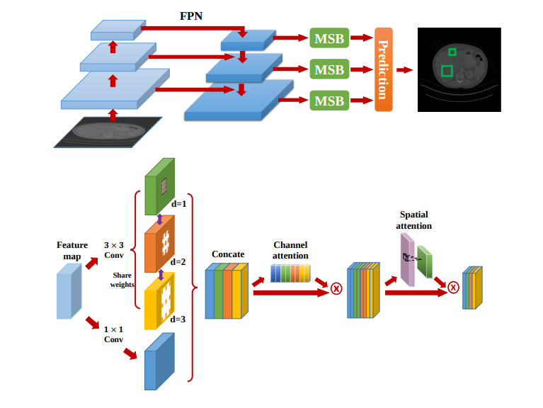

## Attentive CT Lesion Detection Using Deep Pyramid Inference with Multi-Scale Booster

This repo is a implementation of "Attentive CT Lesion Detection Using Deep Pyramid Inference with Multi-Scale Booster"

Our code based on open-mmlab's [mmdetection 18593f6](https://github.com/open-mmlab/mmdetection). We made some changes on mmdetection.


## Introduction

In this paper we propose a Multi-Scale Booster (MSB) with channel and spatial attentions integrated into the backbone Feature Pyramid Network(FPN). In each pyramid level, the proposed MSB captures fine-grained scale variations by using Hierarchically Dilated Convolutions (HDC).Meanwhile, the proposed channel and spatial attention modules increase the network attention on the feature responses to facilitate the lesion detection process.



## Main Result

<table>
	<tr>
		<td rowspan=2 align="center">method</td>
		<td rowspan=2 align="center">backbone</td>
		<td rowspan=2 align="center">number of slices</td>
		<td colspan=5 align="center">FPs per image</td>
	</tr>
	<tr>
		<td align="center">0.5</td>
		<td align="center">1</td>
		<td align="center">2</td>
		<td align="center">4</td>
		<td align="center">8</td>
	</tr>
	<tr>
		<td rowspan=3>3DCE[1]</td>
		<td>VGG-16</td>
		<td align="center">3</td>
		<td align="center">0.569</td>
		<td align="center">0.673</td>
		<td align="center">0.756</td>
		<td align="center">0.816</td>
		<td align="center">0.858</td>
	</tr>
	<tr>
		<td>VGG-16</td>
		<td align="center">9</td>
		<td align="center">0.593</td>
		<td align="center">0.707</td>
		<td align="center">0.791</td>
		<td align="center">0.843</td>
		<td align="center">0.878</td>
	</tr>
	<tr>
		<td>VGG-16</td>
		<td align="center">27</td>
		<td align="center">0.625</td>
		<td align="center">0.737</td>
		<td align="center">0.807</td>
		<td align="center">0.857</td>
		<td align="center">0.891</td>
	</tr>
	<tr>
		<td>Faster Rcnn</td>
		<td>Resnet-50</td>
		<td align="center">3</td>
		<td align="center">0.56</td>
		<td align="center">0.677</td>
		<td align="center">0.763</td>
		<td align="center">0.832</td>
		<td align="center">0.867</td>
	</tr>
	<tr>
		<td>FPN</td>
		<td align="center">Resnet-50</td>
		<td align="center">3</td>
		<td align="center">0.621</td>
		<td align="center">0.728</td>
		<td align="center">0.807</td>
		<td align="center">0.864</td>
		<td align="center">0.89</td>
	</tr>
	<tr>
		<td>FPN + MSB</td>
		<td>Resnet-50</td>
		<td align="center">3</td>
		<td align="center">0.67</td>
		<td align="center">0.768</td>
		<td align="center">0.837</td>
		<td align="center">0.89</td>
		<td align="center">0.91</td>
	</tr>
</table>

## Install

Please refer to [INSTALL.md](INSTALL.md) for installing mmdetection.

(It is recommended that you install mmcv and mmdetection use ```pip install . -e --user```, then you can modify the code)

## Prepare DeepLesion dataset

Download deeplsion dataset[2] in https://nihcc.app.box.com/v/DeepLesion

## Usage

### Train

```
python train.py --cfg config-path
```

### Test

Run test.ipynb(in jupyter) for test.

## References

1. K. Yan, M. Bagheri, and R. M. Summers, “3D Context Enhanced Region-based Convolutional Neural Network for End-to-End Lesion Detection,” in MICCAI, 2018 (arXiv)

2. K. Yan, X. Wang, L. Lu, and R. M. Summers, “DeepLesion: Automated Mining of Large-Scale Lesion Annotations and Universal Lesion Detection with Deep Learning,” J. Med. Imaging, 2018. (paper)
